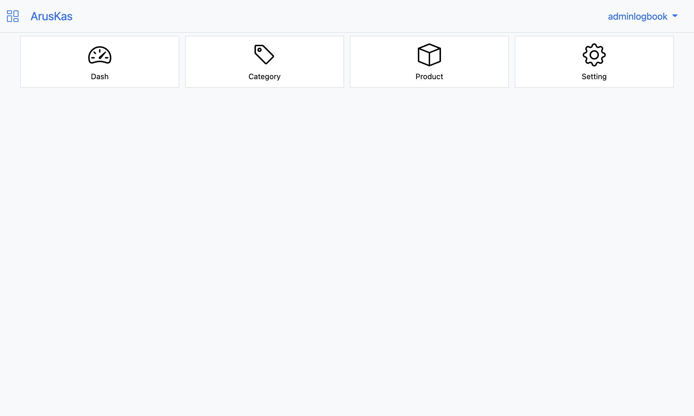
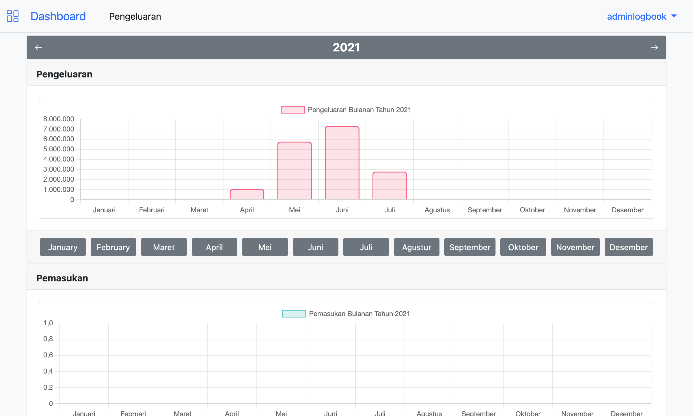
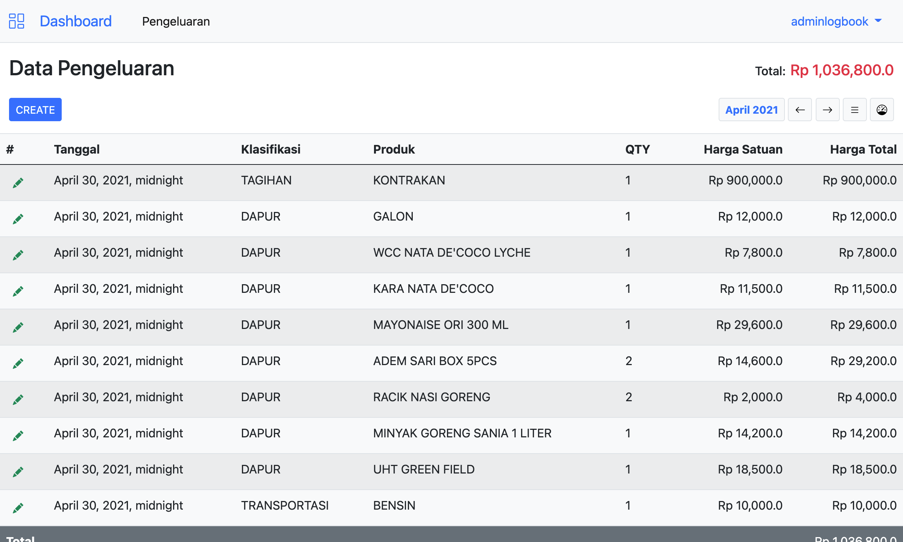
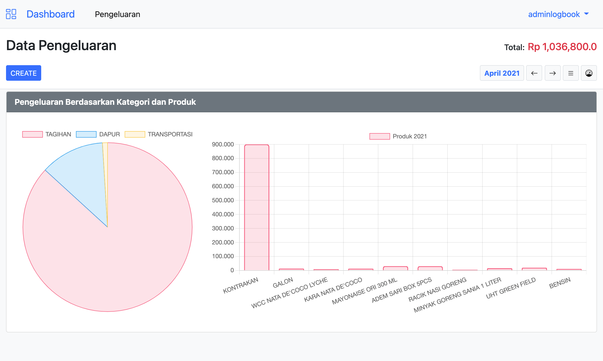

# ArusKas
Aplikasi pencatatan keuangan rumah tangga. Mempermudah analisis arus keuangan bulanan dan tahunan.

## Requirement
- __OS__: Mac, Linux, Windows
- __Python__ 3.9
- __Docker__
- __Git__

## Installation
```sh
# Clone repository
git clone https://github.com/mashanz/logbook-django.git
cd logbook-django

# Run Docker
docker-compose up -d
```
Aplikasi bisa di buka pada browser `https://localhost:8989/`

# Screenshoot

#### Home

#### Dashboard

#### Catatan Keuangan

#### Grafik Keuangan


<hr/>

__maintainer__:  [mashanz](https://github.com/mashanz)